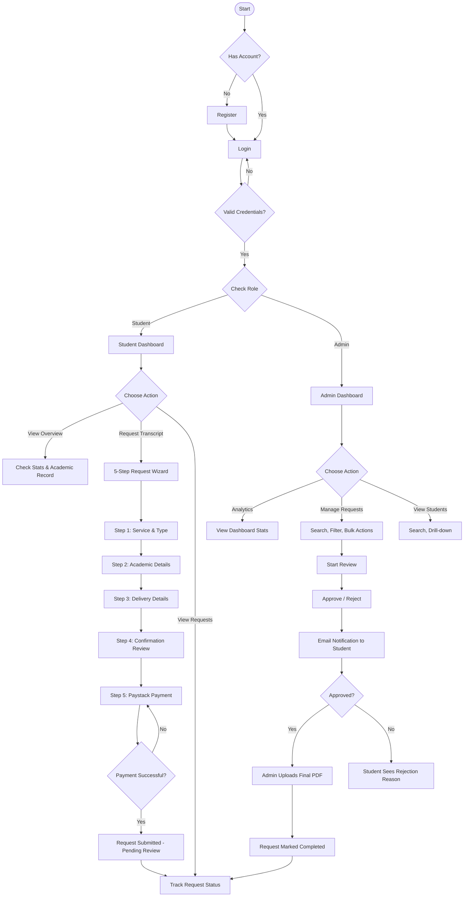
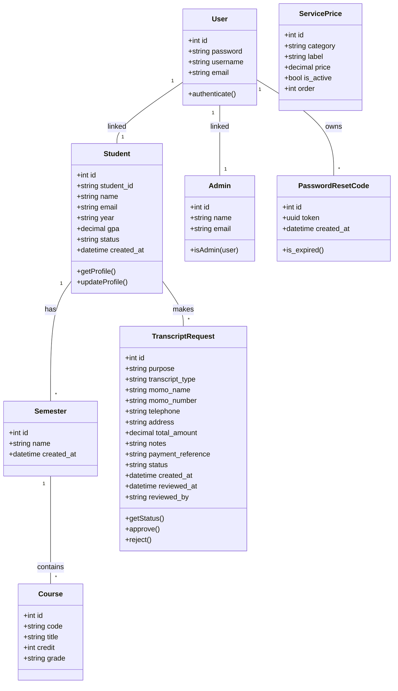
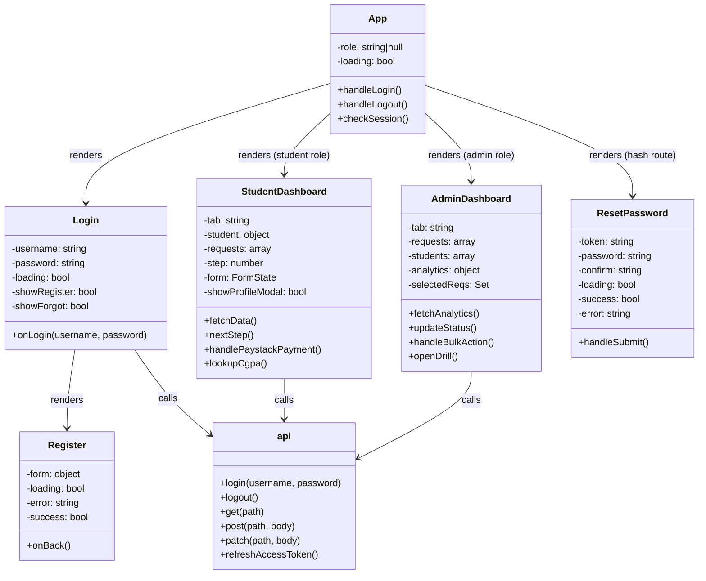
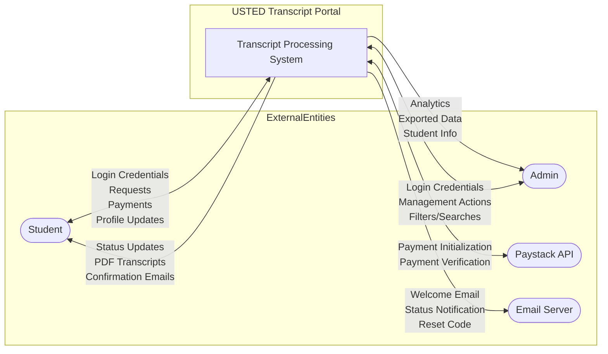
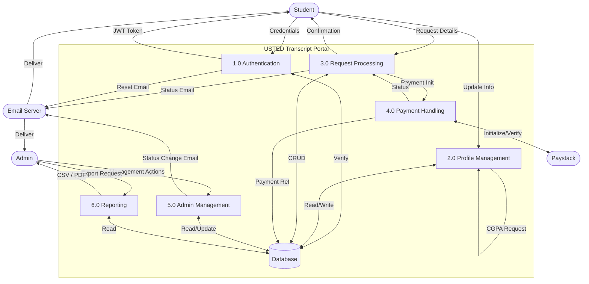
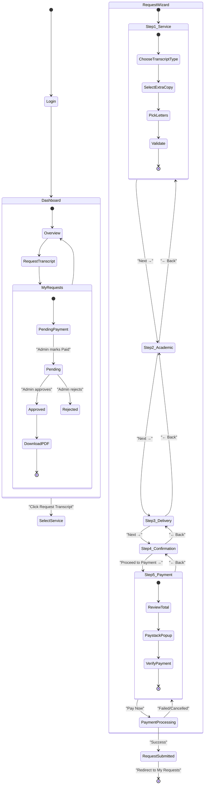
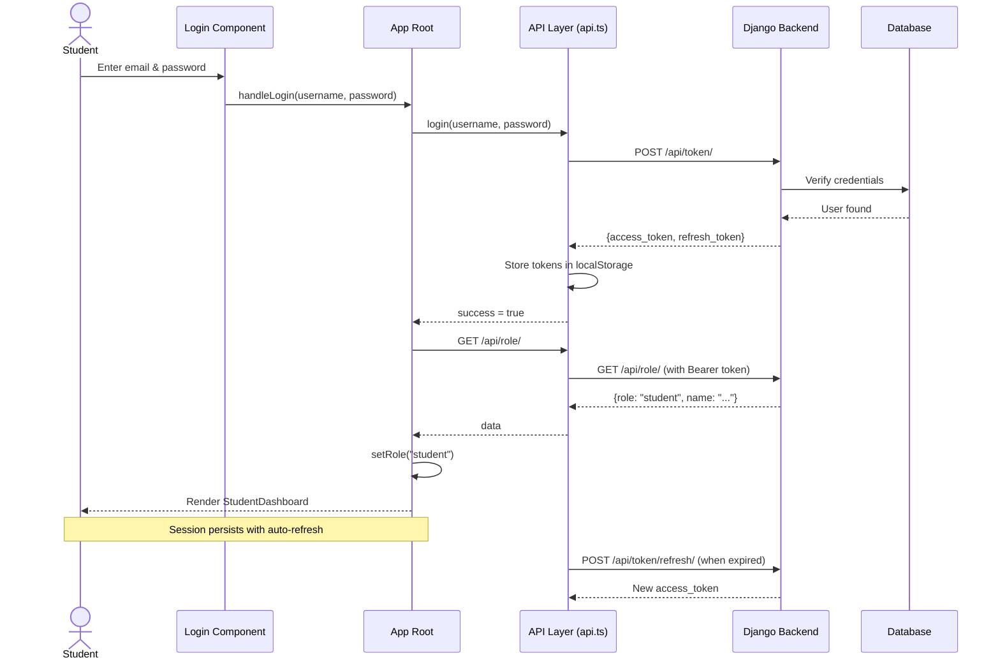
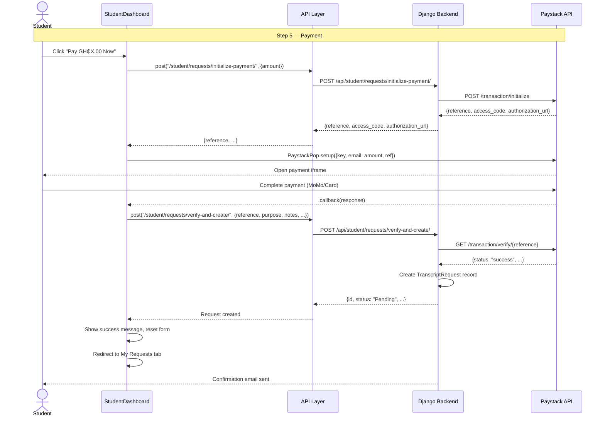
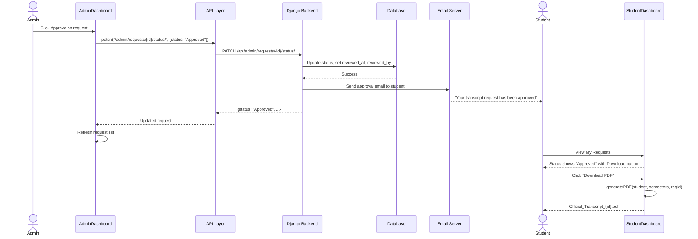

# USTED Transcript Portal — Project Walkthrough

## 1. System Overview & Purpose

The **USTED Transcript Portal** is a web-based system developed for the **University of Education, Winneba — Department of Applied Mathematics (USTED)**. It digitizes and streamlines the process of requesting, processing, and delivering academic transcripts.

### Core Objectives

- Allow students to **request transcripts online** with a guided 5-step wizard
- Integrate **secure online payment** via Paystack (Mobile Money, Visa/Mastercard)
- Enable administrators to **manage, approve/reject, and track** all requests
- Generate **official PDF transcripts** offline with complete academic records
- Provide **real-time analytics** and **CSV export** for administrative reporting

### Key Features

| Feature | Description |
|---------|-------------|
| **Student Registration** | Self-registration with email verification |
| **JWT Authentication** | Token-based secure login with auto-refresh |
| **Profile Management** | Update index number, level; CGPA lookup |
| **5-Step Request Wizard** | Service selection → Academic details → Delivery → Confirmation → Payment |
| **Paystack Payment** | Secure payment with automatic verification |
| **Request Tracking** | Real-time status: Pending Payment → Pending Review → Under Review → Approved/Rejected → Completed |
| **PDF Transcript Generation** | Client-side PDF with branding, academic record, and verification ID |
| **Admin Dashboard** | Analytics, search, pagination, bulk actions, date filters, student drill-down |
| **CSV Export** | One-click export of requests and student records |
| **Email Notifications** | Registration confirmation, status updates, password reset |

---

## 2. Languages & Technologies

### Backend

| Technology | Purpose |
|------------|---------|
| **Python 3.13** | Core programming language |
| **Django 6.0.3** | Web framework |
| **Django REST Framework** | REST API layer |
| **SimpleJWT** | JWT authentication (access + refresh tokens) |
| **SQLite** | Development database |
| **Paystack API** | Payment gateway integration |
| **SMTP** | Email notifications |

### Frontend

| Technology | Purpose |
|------------|---------|
| **TypeScript** | Type-safe JavaScript |
| **React 19** | UI component library |
| **Vite 8** | Build tool and dev server |
| **Bootstrap 5** | CSS framework (grid, utilities) |
| **jsPDF + jspdf-autotable** | Client-side PDF generation |
| **Recharts** | Analytics charts (bar, line) |
| **Paystack Popup** | In-browser payment iframe |

### Architecture Overview

```
┌─────────────────────────────────────────────────────┐
│                   Frontend (React + Vite)            │
│  Localhost:5173                                      │
│  ┌──────────┐  ┌──────────────┐  ┌───────────────┐  │
│  │Login/     │  │Student       │  │Admin          │  │
│  │Register   │  │Dashboard     │  │Dashboard      │  │
│  └──────────┘  └──────────────┘  └───────────────┘  │
│                      ↕ HTTP (JWT)                    │
└──────────────────────┬──────────────────────────────┘
                       │
┌──────────────────────▼──────────────────────────────┐
│               Backend (Django + DRF)                  │
│  Localhost:8000/api/                                  │
│  ┌──────────┐  ┌──────────────┐  ┌───────────────┐  │
│  │Auth Views│  │Student Views │  │Admin Views    │  │
│  └──────────┘  └──────────────┘  └───────────────┘  │
│                      ↕ ORM                            │
│              ┌──────────────────┐                     │
│              │    SQLite DB     │                     │
│              └──────────────────┘                     │
└──────────────────────────────────────────────────────┘
```

---

## 3. System Flowchart



---

## 4. UML Class Diagram



### Frontend Component Hierarchy



---

## 5. Entity Relationship Diagram (ERD)

```mermaid
erDiagram
    User ||--o| Student : has
    User ||--o| Admin : has
    User ||--o{ PasswordResetCode : owns
    Student ||--o{ Semester : enrolls
    Student ||--o{ TranscriptRequest : submits
    Semester ||--o{ Course : includes
    
    User {
        int id PK
        varchar password
        varchar username UK
        varchar email UK
        boolean is_active
    }
    
    Student {
        int id PK
        int user_id FK UK
        varchar student_id UK
        varchar name
        varchar email UK
        varchar year
        decimal gpa
        varchar status
        datetime created_at
    }
    
    Admin {
        int id PK
        int user_id FK UK
        varchar name
        varchar email UK
    }
    
    PasswordResetCode {
        int id PK
        int user_id FK
        uuid token UK
        datetime created_at
    }
    
    Semester {
        int id PK
        int student_id FK
        varchar name
        datetime created_at
    }
    
    Course {
        int id PK
        int semester_id FK
        varchar code
        varchar title
        int credit
        varchar grade
    }
    
    TranscriptRequest {
        int id PK
        int student_id FK
        varchar purpose
        varchar transcript_type
        varchar momo_name
        varchar momo_number
        varchar telephone
        text address
        decimal total_amount
        text notes
        varchar payment_reference
        varchar status
        datetime created_at
        datetime reviewed_at
        varchar reviewed_by
    }
    
    ServicePrice {
        int id PK
        varchar category
        varchar label
        decimal price
        boolean is_active
        int order
    }
```

---

## 6. Use Case Diagram

```mermaid
flowchart TD
    subgraph Student[Student Actor]
        S1[Register Account]
        S2[Login / Authenticate]
        S3[View Profile / Update Index]
        S4[Lookup CGPA]
        S5[Submit Transcript Request]
        S6[Make Payment via Paystack]
        S7[Track Request Status]
        S8[Download Approved PDF]
        S9[Reset Password]
    end
    
    subgraph Admin[Admin Actor]
        A1[Login / Authenticate]
        A2[View Analytics Dashboard]
        A3[Search & Filter Requests]
        A4[Approve / Reject Requests]
        A5[Bulk Update Request Status]
        A6[View Student Details]
        A7[Export CSV Data]
        A8[Generate PDF for Student]
    end
    
    subgraph System[System Boundaries]
        Sys1[Send Email Notifications]
        Sys2[Process Payments]
        Sys3[Generate PDF Transcripts]
        Sys4[Validate JWT Tokens]
        Sys5[Manage Database]
    end
    
    Student --- S1 & S2 & S3 & S4 & S5 & S6 & S7 & S8 & S9
    Admin --- A1 & A2 & A3 & A4 & A5 & A6 & A7 & A8
    S6 -.-> Sys2
    S8 -.-> Sys3
    A4 & A8 -.-> Sys1
    S1 & S9 -.-> Sys1
    S2 -.-> Sys4
    Sys5 --- Sys1 & Sys2 & Sys3 & Sys4
```



### Use Case Narrative

| Actor | Use Case | Description |
|-------|----------|-------------|
| Student | Register Account | Creates account with name, email, password |
| Student | Login | Authenticates via JWT (email + password) |
| Student | Submit Request | 5-step wizard: type, details, delivery, confirmation, payment |
| Student | Make Payment | Paystack checkout: MoMo or card |
| Student | Track Requests | View status (Pending Payment, Pending, Approved, Rejected) |
| Student | Download PDF | Download official transcript for approved requests |
| Admin | Manage Requests | Search, filter, approve/reject, bulk actions |
| Admin | View Analytics | Stats, charts, trends |
| Admin | Export Data | CSV download of requests or students |
| System | Send Email | Confirmations, status updates, password resets |

---

## 7. Context Diagram (DFD Level 0)



---

## 8. Data Flow Diagram (DFD Level 1)



---

## 9. Activity Diagram — Request Submission Flow



---

## 10. Sequence Diagrams

### 10.1 Login & Authentication Flow



### 10.2 Payment & Request Submission Flow



### 10.3 Admin Approval Flow



---

## 11. API Endpoint Reference

### Authentication
| Method | Endpoint | Auth | Description |
|--------|----------|------|-------------|
| POST | `/api/token/` | No | Obtain JWT access + refresh tokens |
| POST | `/api/token/refresh/` | No | Refresh expired access token |
| GET | `/api/role/` | Yes | Get current user's role (student/admin) |

### Student Endpoints
| Method | Endpoint | Auth | Description |
|--------|----------|------|-------------|
| POST | `/api/register/` | No | Create new student account |
| GET | `/api/student/profile/` | Yes | Get full profile + academic record |
| PATCH | `/api/student/profile/update/` | Yes | Update index number and level |
| GET | `/api/student/requests/` | Yes | List all student requests |
| POST | `/api/student/requests/initialize-payment/` | Yes | Initialize Paystack payment |
| POST | `/api/student/requests/verify-and-create/` | Yes | Verify payment and create request |
| GET | `/api/student/cgpa/{student_id}/` | Yes | Lookup CGPA by index number |

### Admin Endpoints
| Method | Endpoint | Auth | Description |
|--------|----------|------|-------------|
| GET | `/api/admin/analytics/` | Yes | Dashboard stats and charts data |
| GET | `/api/admin/requests/` | Yes | List all requests (search, filter, paginate) |
| PATCH | `/api/admin/requests/{id}/status/` | Yes | Update single request status |
| POST | `/api/admin/requests/bulk-status/` | Yes | Bulk update request statuses |
| GET | `/api/admin/requests/export/` | Yes | Export requests as CSV |
| GET | `/api/admin/students/` | Yes | List all students (search, paginate) |
| GET | `/api/admin/students/{id}/` | Yes | Get student detail + requests |
| GET | `/api/admin/students/export/` | Yes | Export students as CSV |

### Public Endpoints
| Method | Endpoint | Auth | Description |
|--------|----------|------|-------------|
| GET | `/api/prices/` | No | List all active service prices |
| POST | `/api/password-reset/` | No | Request password reset email |
| POST | `/api/password-reset/confirm/` | No | Reset password with token |

---

## 12. Database Schema (SQLite)

```sql
-- Core tables (managed by Django ORM)

CREATE TABLE core_student (
    id INTEGER PRIMARY KEY AUTOINCREMENT,
    user_id INTEGER NOT NULL UNIQUE REFERENCES auth_user(id),
    student_id VARCHAR(20) UNIQUE,
    name VARCHAR(100) NOT NULL,
    email VARCHAR(254) NOT NULL UNIQUE,
    year VARCHAR(20),
    gpa DECIMAL(4,2) DEFAULT 0.00,
    status VARCHAR(20) DEFAULT 'Active',
    created_at DATETIME DEFAULT CURRENT_TIMESTAMP
);

CREATE TABLE core_admin (
    id INTEGER PRIMARY KEY AUTOINCREMENT,
    user_id INTEGER NOT NULL UNIQUE REFERENCES auth_user(id),
    name VARCHAR(100) NOT NULL,
    email VARCHAR(254) NOT NULL UNIQUE
);

CREATE TABLE core_semester (
    id INTEGER PRIMARY KEY AUTOINCREMENT,
    student_id INTEGER NOT NULL REFERENCES core_student(id),
    name VARCHAR(50) NOT NULL,
    created_at DATETIME DEFAULT CURRENT_TIMESTAMP
);

CREATE TABLE core_course (
    id INTEGER PRIMARY KEY AUTOINCREMENT,
    semester_id INTEGER NOT NULL REFERENCES core_semester(id),
    code VARCHAR(20) NOT NULL,
    title VARCHAR(100) NOT NULL,
    credit INTEGER NOT NULL,
    grade VARCHAR(5) NOT NULL
);

CREATE TABLE core_transcriptrequest (
    id INTEGER PRIMARY KEY AUTOINCREMENT,
    student_id INTEGER NOT NULL REFERENCES core_student(id),
    purpose VARCHAR(100) NOT NULL,
    transcript_type VARCHAR(200) DEFAULT '',
    momo_name VARCHAR(100) DEFAULT '',
    momo_number VARCHAR(50) DEFAULT '',
    telephone VARCHAR(50) DEFAULT '',
    address TEXT DEFAULT '',
    total_amount DECIMAL(8,2) DEFAULT 0.00,
    notes TEXT DEFAULT '',
    payment_reference VARCHAR(100) DEFAULT '',
    status VARCHAR(20) DEFAULT 'Pending Payment',
    created_at DATETIME DEFAULT CURRENT_TIMESTAMP,
    reviewed_at DATETIME,
    reviewed_by VARCHAR(100) DEFAULT ''
);

CREATE TABLE core_serviceprice (
    id INTEGER PRIMARY KEY AUTOINCREMENT,
    category VARCHAR(20) NOT NULL,
    label VARCHAR(200) NOT NULL,
    price DECIMAL(8,2) NOT NULL,
    is_active BOOLEAN DEFAULT 1,
    "order" INTEGER DEFAULT 0
);
```
